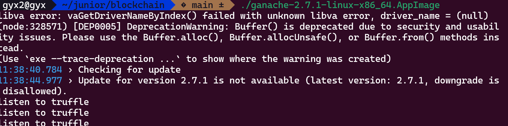

# ZJU-blockchain-course-2025

⬆ 可以️修改成你自己的项目名。

> 第二次作业要求（以下内容提交时可以删除）：
> 
> 进阶的去中心化彩票系统，参与方包括：竞猜玩家、公证人
>
> **背景**：传统的体育彩票系统（例如我国的体育彩票）一般没有彩票交易功能：例如，对于“NBA本赛季MVP为某球员/F1的赛季总冠军为某车队”这类持续时间长的事件的下注一般在赛季开始前就会买定离手，这使得一旦出现突发或不确定事件（如球员A赛季报销/球队B买入强力球星/C车队车手受伤等），很多玩家的选择便会立即失去意义，导致彩票游戏的可玩性下降。因此，一个有趣的探索方向是让彩票系统拥有合规、方便的交易功能。
>
> 建立一个进阶的去中心化彩票系统（可以是体育彩票，或其它任何比赛节目的竞猜，例如《中国好声音》《我是歌手》年度总冠军等，可以参考 [Polymarket](https://polymarket.com/) ），在网站中：
> - 公证人（你自己）可以创立许多竞猜项目：例如某场比赛的输赢、年度总冠军的得主等，每个项目应当有2个或多个可能的选项，一定的彩票总金额（由公证人提供），以及规定好的结果公布时间。
> - 玩家首先领取到测试所需以太币。在网站中，对于一个竞猜项目和多个可能的选项：
>   1. 每个竞彩玩家都可以选择其中的某个选项并购买一定金额（自己定义）的彩票，购买后该玩家会获得一张对应的彩票凭证（一个 ERC721 合约中的 Token）
>   2. 在竞彩结果公布之前，任何玩家之间可以买卖他们的彩票，以应对项目进行期间的任何突发状况。具体的买卖机制如下：一个玩家可以以指定的金额挂单出售（ERC721 Delegate）自己的彩票，其它玩家如果觉得该彩票有利可图就可以买入他的彩票。双方完成一次 ERC721 Token 交易。
>   3. 公证人可以在时间截止时（简单起见，你可以随时终止项目）输入竞猜的结果并进行结算。所有胜利的玩家可以平分奖池中的金额。
> - Bonus（最多5分，若想要完成，可以直接将功能整合进上述要求中）：
>   1. （2分）发行一个 ERC20 合约，允许用户领取 ERC20 积分，并使用ERC20积分完成上述流程。
>   2. （3分）对交易彩票的过程实现一个简单的链上订单簿：卖方用户可以以不同价格出售一种彩票，网页上显示当前订单簿的信息（多少价格有多少该彩票正在出售）。其他用户可以根据最优价格购买彩票。
> - 可以对上述需求进行合理更改和说明。请大家专注于功能实现，网站UI美观程度不纳入评分标准，能让用户能够舒适操作即可。

**以下内容为作业仓库的README.md中需要描述的内容。请根据自己的需要进行修改并提交。**

作业提交方式为：**提交视频文件**和**仓库的链接**到指定邮箱。

## 如何运行

**步骤**:

1. **启动本地区块链**:
  
  - 打开 Ganache 应用，创建一个新的 Workspace 或使用 Quickstart。
  - 记下 RPC Server 地址 (例如 http://127.0.0.1:8545) 和其中一个账户的 Private Key（用于部署合约和作为公证人）。
2. **配置 Hardhat**:
  
  - 进入 ./contracts 目录。
  - 修改 hardhat.config.ts 文件：
    - 确保 networks.ganache.url 与你的 Ganache RPC Server 地址匹配。
    - 将 networks.ganache.accounts 数组中的私钥替换为你从 Ganache 复制的账户私钥。
3. **安装合约依赖**:
  
  - 在 ./contracts 目录下运行:  
    npm install  
    \# 或者 yarn install
4. **编译合约**:
  
  - 在 ./contracts 目录下运行:  
    npx hardhat compile
    
  - 编译成功后，会在 contracts/artifacts/contracts/EasyBet.sol/ 目录下生成 ABI 文件 (EasyBet.json)。
    
5. **部署合约**:
  
  - 在 ./contracts 目录下运行 (确保 Ganache 正在运行):  
    npx hardhat run scripts/deploy.ts \--network ganache
    
  - 部署成功后，终端会输出合约部署到的地址。**复制这个地址**。
    
6. **配置前端**:
  
  - 进入 ./frontend 目录。
  - 打开 src/App.jsx 文件。
  - 找到 const contractAddress \= "YOUR\_DEPLOYED\_CONTRACT\_ADDRESS"; 这一行。
  - 将 "YOUR\_DEPLOYED\_CONTRACT\_ADDRESS" 替换为你上一步复制的合约地址。
  - **(重要)** 找到 const contractABI \= \[...\]。将 ./contracts/artifacts/contracts/EasyBet.sol/EasyBet.json 文件中的 abi 数组内容复制并替换掉 App.jsx 中的 \[...\] 部分。
7. **安装前端依赖**:
  
  - 在 ./frontend 目录下运行:  
    npm install  
    \# 或者 yarn install
8. **启动前端应用**:
  
  - 在 ./frontend 目录下运行:  
    npm start  
    \# 或者 yarn start
    
  - 应用将在浏览器中打开 (通常是 http://localhost:3000)。
    
9. **配置 MetaMask**:
  
  - 确保 MetaMask 已安装并解锁。
  - 将 MetaMask 网络切换到 Ganache 提供的本地网络 (通常是 Localhost 8545 或类似名称，如果不存在需要手动添加网络，使用 Ganache 的 RPC URL)。
  - 导入 Ganache 账户：在 MetaMask 中，点击账户头像 \-\> Import Account，粘贴 Ganache 中某个账户的 Private Key (建议导入部署合约的账户作为公证人，再导入另一个账户作为普通玩家)。
10. **使用 DApp**:
  
  - 刷新前端页面。
  - 点击 "Connect Wallet" 连接 MetaMask。
  - 如果你连接的是部署合约的账户（公证人），你将看到 "Notary Actions" 部分，可以创建和结算活动。
  - 切换到另一个导入的 Ganache 账户（玩家），你可以购买彩票、挂单、购买他人挂单的彩票以及领取奖金。
  - 如果需要测试 ETH，在连接本地 Ganache 时，可以使用 "Get 1 Local Test ETH" 按钮（确保部署合约的账户有足够资金且 MetaMask 连接正常）。

11. 具体的使用流程请看项目运行截图部分

## 功能实现分析

- **项目创建 (createActivity)**: 公证人调用此函数，传入描述、选项数组、结束时间戳，并发送 ETH 作为初始奖池。合约记录项目信息。
  
- **彩票购买 (buyTicket)**: 玩家调用此函数，传入项目 ID、选项索引，并发送 ETH 作为购买金额。合约铸造一个 ERC721 Token 给玩家，记录投注信息，并将 ETH 加入奖池。
  
- **彩票交易**:
  
  - **挂单 (listTicket)**: 玩家先调用 ERC721 的 approve (通过前端触发) 授权合约转移 NFT，然后调用 listTicket 设置价格，合约记录挂单信息。
  - **取消挂单 (cancelListing)**: 卖家调用此函数取消挂单。
  - **购买 (buyListedTicket)**: 买家调用此函数，发送指定价格的 ETH。合约验证支付金额，调用 ERC721 的 transferFrom 转移 NFT，并将 ETH 转给卖家。
- **项目结算 (settleActivity)**: 公证人调用此函数，传入项目 ID 和获胜选项索引。合约标记项目已结束并记录结果。
  
- **奖金领取 (claimWinnings)**: 获胜玩家调用此函数，传入其持有的获胜彩票 Token ID。合约验证条件，计算奖金（基于投注额比例），并将 ETH 转给玩家。奖金计算目前在 claimWinnings 中进行（为了简化部署，但效率不高），理想情况下应在结算时一次性计算或在购买时累积记录获胜投注总额。
  
- **ERC721**: 使的 Ownable (控制公证人权限) 和 ReentrancyGuard (防止重入攻击)。
## 项目运行截图

放一些项目运行截图。

项目运行成功的关键页面和流程截图。主要包括操作流程以及和区块链交互的截图。

阶段二：公证人创建竞猜
连接钱包：在浏览器打开的前端页面 (http://localhost:3000)，使用你的账户1（公证人） 连接 MetaMask 钱包。

查看界面：连接成功后，你应该能看到一个黄色的 "🔑 Notary Actions" 模块，这证明你被识别为公证人。

创建活动：

在 "➕ Create New Activity" 表单中：

Description: 填写竞猜描述，例如 "2025年NBA总冠军"。

Options: 填写选项（用逗号隔开），例如 "湖人,凯尔特人,掘金"。

End Time: 选择一个未来的日期和时间。

Initial Pool (ETH): 填写一个初始奖池金额，例如 0.1 ETH。

点击 "Create Activity" 按钮，并在 MetaMask 中确认交易。

查看结果：交易确认后，你创建的活动会立即出现在左侧的 "🎰 Available Activities" 列表中，状态为 "Active"。

阶段三：玩家 A 购买彩票
切换账户：打开 MetaMask，切换到你的账户2（玩家A）。

获取测试ETH：（如果这个账户没钱）点击 "Get 1 Local Test ETH" 按钮，获取一些测试用的 ETH。

购买彩票：

在 "🛒 Buy Ticket" 表单中：

Activity ID: 填写你刚刚创建的活动 ID（例如 1）。

Option Index: 填写你支持的选项索引（例如 0 代表湖人）。

Amount (ETH): 填写你要投注的金额，例如 0.05 ETH。

点击 "Buy Ticket" 按钮，并在 MetaMask 中确认交易（会发送 0.05 ETH）。

查看结果：交易确认后：

"Available Activities" 列表中的奖池金额（Pool）会增加 0.05 ETH。

"🎟️ My Tickets (NFTs)" 列表中会出现一张新的彩票（例如 Token ID: 1），显示你选择了选项 "0: 湖人"。

阶段四：玩家 A 出售彩票（交易功能）
这是项目的核心功能。

挂单：

在 "🏷️ List Ticket for Sale" 表单中：

Token ID to List: 填写你刚买的彩票 ID（例如 1）。

Price (ETH): 填写你希望的卖出价格，例如 0.1 ETH（你想赚一笔）。

点击 "Approve & List Ticket" 按钮。

确认交易：

MetaMask 会弹出两次交易确认：

第一次（Approve）：授权合约可以转移你的这张 NFT 彩票。

第二次（ListTicket）：正式将彩票挂单。

查看结果：

你的 "My Tickets" 列表中的彩票会变成黄色，并显示 "Listed for: 0.1 ETH"。

在 "🛒 Marketplace" 列表中也会出现这张彩票。

阶段五：玩家 B 购买彩票
切换账户：打开 MetaMask，切换到你的账户3（玩家B）（或者用账户1公证人来买也行，只要不是玩家A就行）。

获取测试ETH：同样，如果没钱，点击 "Get 1 Local Test ETH"。

购买挂单：

在 "🛒 Marketplace (Listed Tickets)" 列表中找到玩家A挂单的彩票（Token ID: 1）。

点击旁边的 "Buy" 按钮。

MetaMask 会弹出交易确认，要求你支付挂单的价格（0.1 ETH）。

查看结果：交易确认后：

玩家A（切换回去看）："My Tickets" 中的彩票消失了。

玩家B（当前账户）："My Tickets" 列表中出现了这张彩票（Token ID: 1）。

"Marketplace" 列表中的这张彩票消失了。

（玩家A的钱包余额增加了 0.1 ETH）。

阶段六：公证人结算并领取奖金
切换账户：打开 MetaMask，切换回账户1（公证人）。

结算活动：

在 "🏁 Settle Activity" 表单中：

Activity ID: 填写活动 ID（例如 1）。

Winning Option: 填写一个获胜选项的索引。我们假设获胜者是湖人，所以填 0。

点击 "Settle Activity" 按钮，并在 MetaMask 中确认交易。

查看结果：

"Available Activities" 列表中的活动状态变为 "Settled (Winner: 0)"。

切换账户并领奖：

打开 MetaMask，切换到账户B（因为他现在是彩票的持有者）。

在 "My Tickets" 列表中，你会看到你的彩票（Token ID: 1）现在显示为 "WINNER"，并且出现了一个 "Claim Winnings" 按钮。

点击 "Claim Winnings" 按钮，并在 MetaMask 中确认交易。

最终结果：交易确认后，玩家B的钱包会收到奖池里的所有奖金（因为他是唯一的获胜者）。彩票状态更新为 "WINNER (Claimed)"。

## 参考内容

- 课程的参考Demo见：[DEMOs](https://github.com/LBruyne/blockchain-course-demos)。

- 快速实现 ERC721 和 ERC20：[模版](https://wizard.openzeppelin.com/#erc20)。记得安装相关依赖 ``"@openzeppelin/contracts": "^5.0.0"``。

- 如何实现ETH和ERC20的兑换？ [参考讲解](https://www.wtf.academy/en/docs/solidity-103/DEX/)

如果有其它参考的内容，也请在这里陈列。
