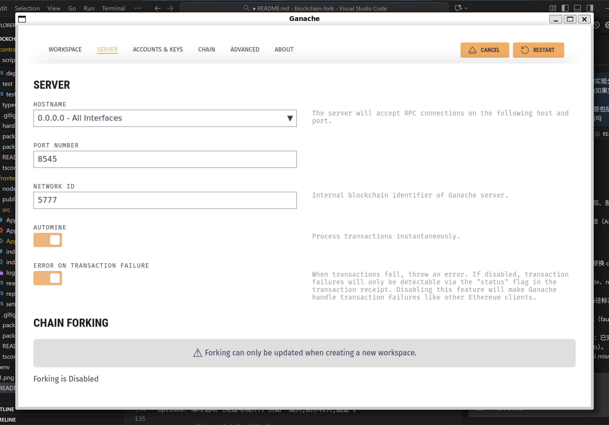

# EasyBet：一个基于区块链分叉的竞猜 DApp
课程: 区块链与数字货币
姓名: 葛芸曦
学号: 3230104150
日期: 2025年11月4日
# 项目介绍
本项目是一个名为 “EasyBet” 的去中心化应用（dApp）。它构建在以太坊区块链（或兼容的 EVM 链）上，旨在模拟一个简单的竞猜游戏（例如，抛硬币猜正反面）。

项目后端是一个用 Solidity 编写的智能合约 (EasyBet.sol)，它负责处理竞猜逻辑、接收下注和分发奖励。前端是一个使用 React 和 TypeScript 构建的网页应用，用户可以通过它与智能合约进行交互。

本项目利用 Hardhat 作为开发环境，在本地分叉（fork）的网络上进行合约的部署和测试，这使得开发和调试过程更加高效。用户可以通过连接他们的加密钱包（如 MetaMask）来下注，并查看竞猜结果。
# 功能介绍
## 公证人 (Owner):

创立竞猜项目（设置主题，选项，初始池子金额，结束时间），结束竞猜项目（设置答案，结算金额），查看竞猜项目及其状态
## 玩家(User):
连接 MetaMask 钱包。
领取测试以太币。
查看当前的竞猜项目及其状态。
输入金额并选择选项进行下注。
出售彩票。查看订单簿按彩票种类和价格二次分类的详细信息，在订单簿购买彩票（单买彩票，直接买最高性价比的彩票）。
领取奖金（不是平分的，是按照购入权重比例分的）。


# 功能实现分析(含订单簿 Bonus +3)
### 智能合约
- **核心合约（EasyBet.sol）**
EasyBet.sol继承了 OpenZeppelin 的标准合约，以确保安全性、可管理性和代币标准化：

ERC721("EasyBet Ticket", "EBT"): 这使得合约本身就是一个 NFT 合约。每个用户下的赌注都会被铸造（Mint）成一个唯一的 NFT（我们称之为“彩票”），使其具有所有权和可交易性。

Ownable: 引入了合约所有者（Owner）的概念，即部署合约的“公证人”（Notary）。createActivity 和 settleActivity 这两个关键函数被 onlyOwner 修饰符保护，确保只有公证人才能创建和结算竞猜活动。

ReentrancyGuard: 所有涉及资金转移（ETH）的函数（如 buyTicket, listTicket, buyListedTicket, claimWinnings）都被 nonReentrant 修饰符保护，防止在资金转移过程中发生“重入攻击”。
```solidity
contract EasyBet is ERC721, Ownable, ReentrancyGuard {
}
```
### 重要数据结构
- struct Activity: 存储一个竞猜活动的所有信息，包括描述、选项 (string[] options)、结束时间、总奖池 (totalPool)、是否已结算 (settled) 以及获胜选项 (winningOption)。

- struct BetInfo: 存储一个特定赌注（“门票”）的信息，包括它属于哪个活动 (activityId)、玩家地址、下注时选择的选项 (optionIndex)、下注金额 (amount) 以及是否已领取奖金 (claimed)。

- struct Listing: 存储 NFT 门票在二级市场上的挂单信息，包括卖家、价格和是否激活。
```solidity
    struct Activity {
        uint256 id;                 
        string description;        
        string[] options;           
        uint256 endTime;            
        uint256 totalPool;         
        address payable notary;     
        bool settled;               
        uint256 winningOption;      
        uint256 totalWinningAmount; 
    }
    struct BetInfo {
        uint256 activityId;         
        address player;             
        uint256 optionIndex;        
        uint256 amount;             
        bool claimed;              
    }
    struct Listing {
        address seller;             
        uint256 price;             
        bool active;                /
    }
```
### 重要函数
- **项目创建 (createActivity)**: 公证人调用 createActivity()，传入描述、选项数组和结束时间。公证人需要支付一笔初始资金（msg.value）作为活动的启动奖池。
```solidity
function createActivity(
        string memory _description,
        string[] memory _options,
        uint256 _endTime
    ) external payable onlyOwner {
        require(_options.length >= 2, "Must have at least two options");
        require(_endTime > block.timestamp, "End time must be in the future");
        require(msg.value > 0, "Initial pool must be greater than zero");//错误检查

        _activityIds.increment();
        uint256 newActivityId = _activityIds.current();

        activities[newActivityId] = Activity({
            id: newActivityId,
            description: _description,
            options: _options,
            endTime: _endTime,
            totalPool: msg.value, 
            notary: payable(owner()),
            settled: false,
            winningOption: 0, 
            totalWinningAmount: 0
        });
//创建活动
        emit ActivityCreated(newActivityId, _description, _options, _endTime);//发布活动
    }
  ```
- **彩票购买 (buyTicket)**: 用户调用 buyTicket()，传入 activityId 和 _optionIndex。
  - 合约检查活动是否存在、是否已结算、是否已过截止时间。
  - 用户的 msg.value (下注金额) 被添加到 activity.totalPool。
  - 核心: 合约调用 _safeMint(msg.sender, newTokenId)，为用户铸造一个代表此赌注的 NFT。
  - 合约在 ticketInfo 中记录这个新 tokenId 对应的赌注详情。
```solidity
 function buyTicket(uint256 _activityId, uint256 _optionIndex) external payable nonReentrant {
        Activity storage activity = activities[_activityId];

        if (activity.id == 0) revert ActivityNotFound(); // 检查活动是否存在、是否已结算、是否已过截止时间。
        if (activity.settled) revert ActivityAlreadySettled();
        if (block.timestamp >= activity.endTime) revert BettingClosed();
        if (_optionIndex >= activity.options.length) revert InvalidOption();
        if (msg.value == 0) revert InvalidAmount();

        // Increment pool
        activity.totalPool += msg.value;

        //铸造一个代表此赌注的 NFT
        _tokenIds.increment();
        uint256 newTokenId = _tokenIds.current();
        _safeMint(msg.sender, newTokenId);

        // 在 ticketInfo 中记录这个新 tokenId 对应的赌注详情
        ticketInfo[newTokenId] = BetInfo({
            activityId: _activityId,
            player: msg.sender,
            optionIndex: _optionIndex,
            amount: msg.value,
            claimed: false
        });
//发布
        emit TicketPurchased(newTokenId, _activityId, msg.sender, _optionIndex, msg.value);
    }
```
- **项目结算 (settleActivity)**: 竞猜结束后，公证人调用 settleActivity()，传入 activityId 和 _winningOptionIndex，合约将活动标记为 settled 并记录获胜选项。
```solidity
   function settleActivity(uint256 _activityId, uint256 _winningOptionIndex) external onlyOwner {
        Activity storage activity = activities[_activityId];
      //此处省略错误检查
      //标记为 settled 并记录获胜选项
        activity.settled = true;
        activity.winningOption = _winningOptionIndex;
        emit ActivitySettled(_activityId, _winningOptionIndex);
    }
```
- **奖金领取 (claimWinnings)**: 获胜的用户（即持有 optionIndex 与 winningOption 相匹配的 NFT 门票的玩家）调用 claimWinnings()。
  - 合约检查用户是否是 NFT 持有者、活动是否结算、门票是否中奖、是否已领奖。
  - 奖金计算: 奖金是按比例分配的。计算公式为 (bet.amount * activity.totalPool) / totalWinningAmount。
  - 合约将计算出的 winnings（ETH）发送给用户。
```solidity
function claimWinnings(uint256 _tokenId) external nonReentrant {
        BetInfo storage bet = ticketInfo[_tokenId];
        Activity storage activity = activities[bet.activityId];
      //此处省略错误检查
        uint256 totalWinningAmount = activity.totalWinningAmount;
        if (totalWinningAmount == 0) {
           totalWinningAmount = _calculateTotalWinningAmount(bet.activityId);
              activity.totalWinningAmount = totalWinningAmount;
        }
        if (totalWinningAmount == 0) {
             bet.claimed = true; 
             emit WinningsClaimed(_tokenId, msg.sender, 0);
             return;
        }}

```
- **彩票交易**:
  这是项目的一个高级bonus+3功能。如果一个用户在活动结算前，认为自己持有的彩票会输，或者想提前锁定利润，他可以将其以任意价格卖掉
  - **挂单 (listTicket)**: 持有者（ownerOf(_tokenId)）首先需要调用 approve(address(this), _tokenId)（前端 App.tsx 中已处理），授权合约可以转移这个 NFT。然后调用 listTicket() 设置价格。
```solidity
function listTicket(uint256 _tokenId, uint256 _price) external nonReentrant {
      //此处省略错误检查
        BetInfo storage bet = ticketInfo[_tokenId];
        Activity storage activity = activities[bet.activityId];
        if (activity.settled) revert ActivityAlreadySettled();
        listings[_tokenId] = Listing({
            seller: msg.sender,
            price: _price,
            active: true
        });

        emit TicketListed(_tokenId, msg.sender, _price);
    }
```
  - **取消挂单 (cancelListing)**: 卖家调用此函数取消挂单。
```solidity
function cancelListing(uint256 _tokenId) external nonReentrant {
        Listing storage listing = listings[_tokenId];
        //此处省略错误检查
        listing.active = false;
        emit ListingCancelled(_tokenId);
    }
```
  - **购买 (buyListedTicket)**: 任何其他用户都可以调用此函数，支付挂单者（listing.seller）设定的价格（msg.value == listing.price）。
  - 合约调用 _transfer(seller, msg.sender, _tokenId) 将 NFT 转移给新买家。
  - 合约将 msg.value（即售价）发送给原卖家。
  - ticketInfo[tokenId].player 被更新为新买家地址，这意味着新买家继承了这张门票领取奖金的权利。
```solidity
function buyListedTicket(uint256 _tokenId) external payable nonReentrant {
        Listing storage listing = listings[_tokenId];
        address seller = listing.seller; 
        //此处省略错误检查
        listing.active = false;
        _transfer(seller, msg.sender, _tokenId);
        (bool success, ) = seller.call{value: msg.value}("");
        if (!success) revert TransferFailed();
        ticketInfo[_tokenId].player = msg.sender;
        emit TicketSold(_tokenId, seller, msg.sender, msg.value);
    }
```
- **订单簿实现:**
- 链上: 合约保持简单，只存储单个 tokenId 的挂单信息 (listings mapping)，包含卖家地址和 ETH 价格。
- 链下 (前端 App.tsx):

    - fetchData 函数会调用 contract.totalSupply() 获取总票数。
    然后它会循环（从 i = 0 到 totalSupply - 1），对每个索引调用contract.tokenByIndex(i) 来获取 tokenId。对每个 tokenId，它会并行获取 ownerOf, getListing, 和 getTicketInfo。
    - 前端过滤出所有活跃的、非当前用户拥有的挂单，并将它们收集到一个临时数组 allListings 中。接着，代码处理 allListings 数组：按 activityId 和 optionIndex 分组。在每个选项组内，按 price (ETH 价格) 再次分组。统计每个价格层级有多少个 tokenId 可供购买。最终构建出一个嵌套的 orderBooks 状态变量，并渲染到 "Order Books" 栏中。
    - 购买: 当用户点击 "Buy Cheapest" 时，前端会从 orderBooks 状态中取出该价格层级的 tokenIds 列表中的第一个 tokenId，然后调用 handleBuyFromOrderBook 函数，该函数会触发 buyListedTicket(tokenId, { value: price }) 交易。

### 前端重要函数
- 钱包连接: connectWallet 函数通过 window.ethereum (MetaMask 注入的对象) 创建 Ethers.js 的 Web3Provider 和 Signer，并获取用户账户。
```solidity
// 钱包连接
const web3Provider = new ethers.providers.Web3Provider((window as any).ethereum);
await web3Provider.send("eth_requestAccounts", []);
const web3Signer = web3Provider.getSigner();
const userAccount = await web3Signer.getAddress();
const network = await web3Provider.getNetwork();
console.log('Connected network:', network);
// 将 provider 暴露到 window 以便在控制台调试
(window as any).__appProvider = web3Provider;
const code = await web3Provider.getCode(contractAddress);
console.log('Contract code at address:', contractAddress, code);
if (!code || code === '0x') {
    setErrorMessage(`No contract found at ${contractAddress} on network ${network.name || network.chainId}. Please switch MetaMask to the correct network or update contractAddress.`);
    setLoadingMessage('');
     return;
}
//合约连接
const easyBetContract = new ethers.Contract(contractAddress, contractABI, web3Signer);
```
- 数据获取 (fetchData): 这是前端的“同步”功能。它会在应用加载和交易成功后被调用。它通过合约的 view 函数（如 totalActivities, getActivity, getTicketInfo）读取所有活动和门票数据，并将其处理后存入 React state，触发界面刷新。
```solidity
const fetchData = useCallback(async () => {
        if (!contract || !account || !provider) return;
        setLoadingMessage('Fetching contract data...');
        setErrorMessage('');
        try {
        // --- Activities ---
        const totalActs = await contract.totalActivities();
        //省略变量初始化
        for (let i = 1; i <= totalActs.toNumber(); i++) {
            actPromises.push(contract.getActivity(i));
        }
        const actResults = await Promise.allSettled(actPromises);
        actResults.forEach((result) => {
            if (result.status === 'fulfilled') {
                const actData = result.value;
                fetchedActivities.push({
              //省略创建活动列表
                });
            }
        });

        // --- Tickets ---
        const totalTickets = await contract.totalTickets();
        //省略变量初始化
        for (let id = 1; id <= total; id++) {
            ticketInfoPromises.push(
                Promise.all([
                    Promise.resolve(id),
                    contract.getTicketInfo(id).catch(() => null),
                    contract.getListing(id).catch(() => null)
                ]).catch(() => null)
            );
        }
        const ticketResults = await Promise.allSettled(ticketInfoPromises);
        
      //省略创建票列表
      //和活动关联，设置winner和loser的权限
      //省略更新票列表
        }}
        // --- Contract balance ---
        try {
            const bal = await provider.getBalance(contractAddress);
            setContractBalance(bal);
        } catch (balErr) {
        //省略错误处理
}, [contract, account, provider]);
```
- 交易处理 (handleTx): 这是一个封装了合约写入操作的辅助函数。
1. 显示 "Processing transaction..." 加载提示。
2. 等待交易被矿工打包（await tx.wait()）。
3. 在成功后调用 fetchData() 来刷新界面，确保用户能立即看到变更。
```solidity
const handleTx = async (txPromise: Promise<any>, successMsg: string) => {
//省略初始化
        try {
            const tx = await txPromise;
            setLoadingMessage('Waiting for confirmation...');
            await tx.wait();
            setSuccessMessage(successMsg);
            fetchData(); // Refresh data after successful transaction
        } catch (error: any) {
        //省略错误处理
        }
    };
```

调用示例

```solidity
await handleTx(
                contract.connect(signer).createActivity(newActivityDesc, optionsArray, endTimeTimestamp, { value: poolAmount, gasLimit }),
                'Activity created successfully!'
            );
```

- 还有类似createActivity的前端功能函数，基本实现都是直接调用合约ABI接口进行活动，按照需求可能有模拟预估，余额检查，和发送交易
```solidity
//省略验证和解码
//模拟和预估：构建一个“交易草案”，问区块链节点能否成功
  const txData = contract.interface.encodeFunctionData("createActivity", [newActivityDesc, optionsArray, endTimeTimestamp]);
            const callTx = {
                to: contractAddress,
                from: account,
                data: txData,
                value: poolAmount.toHexString()
            };

//余额检查
            let gasEstimate;
            try {
                gasEstimate = await contract.estimateGas.createActivity(newActivityDesc, optionsArray, endTimeTimestamp, { value: poolAmount });
            } catch (gasErr: any) {
                console.error("Gas estimate failed:", gasErr);
                // try to extract reason similarly
                const hex = gasErr?.error?.data || gasErr?.data || null;
                const reason = decodeRevertReason(hex);
                setErrorMessage(`Estimate gas failed: ${reason || gasErr?.message || String(gasErr)}`);
                return;
            }
//真正发送交易
await handleTx(
                contract.connect(signer).createActivity(newActivityDesc, optionsArray, endTimeTimestamp, { value: poolAmount, gasLimit }),
                'Activity created successfully!'
            );
//省略清理和错误处理
```
# 如何运行

**步骤**:

1. **启动本地区块链**:
  
  - 打开 Ganache 应用， Quickstart。
  - 把RPC Server 地址 改成 http://127.0.0.1:8545  。复制地址和其中一个账户的 Private Key（用于部署合约和作为公证人）。
2. **配置 Hardhat**:
  - 修改 hardhat.config.ts 文件：
    - 把networks.ganache.url 复制为Ganache RPC Server 地址。
    - 把 networks.ganache.accounts 数组中的私钥替换为从 Ganache 复制的账户私钥。
3. **安装合约依赖**:
  - 在 ./contracts 目录下运行:  
    `npm install`  这里遇到了问题，默认安装的@openzeppelin/contracts版本是错的，很多包会找不到，所以手动intall一个版本。还有后面import的ether也需要自己安装@5版本。
4. **编译合约**:
  
  - 在 ./contracts 目录下运行:  
    `npx hardhat compile`
    
  - 编译成功后，在 contracts/artifacts/contracts/EasyBet.sol/ 目录下生成 ABI 文件 (EasyBet.json)。
    
5. **部署合约**:
  
  - 在 ./contracts 目录下运行 (确保 Ganache 正在运行):  
    `npx hardhat run scripts/deploy.ts \--network ganache`
    
  - 部署成功后，终端会输出合约部署到的地址。**复制这个地址**。
    
6. **配置前端**:
  
  - 进入 ./frontend 目录。
  - 打开 src/App.jsx 文件。
  - 找到 const contractAddress = "(现在是我的合约地址)"; 这一行。
  - 将 "(现在是我的合约地址)" 替换为你上一步复制的合约地址。
  -  找到 const contractABI= [] 。将 ./contracts/artifacts/contracts/EasyBet.sol/EasyBet.json 文件中的 abi 数组内容复制并替换掉 App.jsx 中的 [] 部分。
7. **安装前端依赖**: 
  - 在 ./frontend 目录下运行:  
    npm install  
8. **启动前端应用**:
  - 在 ./frontend 目录下运行:  
    npm start  
  - 应用将在浏览器中打开 ( http://localhost:3000  )。
    
9. **配置 MetaMask**:
  
  - 确保 MetaMask 已安装并解锁。
  - 将 MetaMask 网络切换到 Ganache 提供的本地网络 (使用 Ganache 的 RPC URL,也就是http:localhost:8545)。
  - 导入 Ganache 账户：在 MetaMask 中，点击账户头像 \-\> Import Account，粘贴 Ganache 中某个账户的 Private Key (建议导入部署合约的账户作为公证人，再导入另一个账户作为普通玩家)。
10. **使用 DApp**:
  
  - 刷新前端页面。
  - 点击 "Connect Wallet" 连接 MetaMask。
  - 如果连接的是部署合约的账户（公证人），将看到 "Notary Actions" 部分，可以创建和结算活动,也可以购买彩票，挂单，购买他人挂单的彩票和领取奖金。
  - 切换到另一个导入的 Ganache 账户（玩家），你可以购买彩票、挂单、购买他人挂单的彩票以及领取奖金。


11. 具体的使用流程请看功能项目运行及功能测试部分

# 项目运行以及功能测试截图
### 阶段一：链的部署

打开Ganache


修改地址



修改 hardhat.config.ts 文件：
    - 把networks.ganache.url 复制为Ganache RPC Server 地址。
    - 把 networks.ganache.accounts 数组中的私钥替换为从 Ganache 复制的账户私钥。
  


**编译合约**:
  
  - 在 ./contracts 目录下运行:  
    `npx hardhat compile`
    
  - 编译成功后，在 contracts/artifacts/contracts/EasyBet.sol/ 目录下生成 ABI 文件 (EasyBet.json)。
  
    

**部署合约**:
  
  - 在 ./contracts 目录下运行 (确保 Ganache 正在运行):  
    `npx hardhat run scripts/deploy.ts \--network ganache`
  - 部署成功后，终端会输出合约部署到的地址。**复制这个地址**。
  
  - 
  
并且可以看到区块


1. **配置前端**:
  
  - 进入 ./frontend 目录。
  - 打开 src/App.jsx 文件。
  - 找到 const contractAddress = "(现在是我的合约地址)"; 这一行。
  - 将 "(现在是我的合约地址)" 替换为你上一步复制的合约地址。
  - **(重要)** 找到 const contractABI = [...]。将 ./contracts/artifacts/contracts/EasyBet.sol/EasyBet.json 文件中的 abi 数组内容复制并替换掉 App.jsx 中的 [...] 部分。

2. **启动前端应用** :
    
  - 在 ./frontend 目录下运行:  
    npm start  
    
    

  - 应用将在浏览器中打开 ( http://localhost:3000  )。
    
**配置 MetaMask**:
浏览器打开后MetaMask会自动弹出。首先要登录。
将 MetaMask 网络切换到 Ganache 提供的本地网络 (使用 Ganache 的 RPC URL,也就是http:localhost:8545)。


导入 Ganache 账户：在 MetaMask 中，点击账户头像 \-\> Import Account，粘贴 Ganache 中账户的 Private Key (公证人账户和几个普通玩家)。


在弹出的小狐狸插件点击连接到localhost:3000


在起始页面点击connect wallet


### 阶段二：公证人创建竞猜

先用公证人连接，连接成功后，看到（Notary）和黄色的 "🔑 Notary Actions" 模块，这证明被识别为公证人。


1. **创建活动：**
在 "➕ Create New Activity" 表单中填写Description，Options（逗号隔开），End Time（不能比当前时间小），Initial Pool (ETH)


点击 "Create Activity" 按钮，并在 MetaMask 中点击确认交易。
交易确认后，创建的活动会立即出现在左侧的 "🎰 Available Activities" 列表中，状态为 "Active"。


同时在ganache产生交易区块


2. **玩家 A 购买彩票**
切换账户：打开 MetaMask，切换到账户2（玩家A）。


获取测试ETH：（如果这个账户没钱）点击 "Get 1 Local Test ETH" 按钮，获取一些测试用的 ETH。

在 "🛒 Buy Ticket" 表单中填写ctivity ID，Option Index，Amount (ETH)
点击 "Buy Ticket" 按钮，并在 MetaMask 中确认交易


查看结果：交易确认后：


"Available Activities" 列表中的奖池金额（Pool）会增加。


"🎟️ My Tickets (NFTs)" 列表中会出现一张新的彩票（例如 Token ID: 1）


3. **玩家 A 出售彩票（交易功能）**
挂单：
在 "🏷️ List Ticket for Sale" 表单中填写Token ID to List: 买的彩票 ID，
Price (ETH):希望的卖出价格。


点击 "Approve & List Ticket" 按钮。
确认交易：
MetaMask 会弹出两次交易确认：
第一次（Approve）：授权合约可以转移你的这张 NFT 彩票。


第二次（ListTicket）：正式将彩票挂单。


查看结果：
"My Tickets" 列表中的彩票会显示 "Listed for: 多少 ETH"。而且会出现一个cancel按钮，点击了就会取消挂单


在 "🛒 Marketplace" 列表中也会出现这张彩票。


4. **玩家 B 购买彩票**
切换账户：打开 MetaMask，切换到另一个账户
购买挂单：

在 "🛒 order books (sell orders)" 列表中找到玩家A挂单的彩票。Order Books" 区域应该能看到账户A挂单的彩票，按活动、选项和价格汇总显示。为了能看清整个订单簿的结构我多挂了几张


可以看到每个彩票选项都是分开挂单的。同时一个彩票选项会分成不同的价位，每个价位下有所有该价位彩票的详细信息，包括卖家和彩票金额。点击Buy first的时候会自动购买同一价位下代表金额最高的那一张彩票。

假如想单独购买也可以在详细信息下面选择Buy Pay ETH.
MetaMask 会弹出交易确认，要求你支付挂单的价格(这里用buy first做例子)


30价位的银灰有3张，分别买了1,15，5ETH，我想要代表金额最多的一张
交易确认后：
"🛒 order books (sell orders)" 中的彩票消失了。


玩家B（当前账户）："My Tickets" 列表中出现了这张彩票（Token ID: 12）。


切换回上一个用户，发现12号彩票已经消失了


ganache里多出一笔交易


5. **公证人结算并领取奖金**
打开 MetaMask，切换回账户1（公证人）。
在 "🏁 Settle Activity" 表单中：


填写Activity ID，Winning Option。
点击 "Settle Activity" 按钮，并在 MetaMask 中确认交易。

查看结果：
"Available Activities" 列表中的活动状态变为 "Settled (Winner: 0)"。


切换账户并领奖：
打开 MetaMask，切换到账户B（因为他现在是彩票的持有者）。


在 "My Tickets" 列表中，会看到彩票显示为 "WINNER"，并且出现了一个 "Claim Winnings" 按钮。没中奖的则显示为"LOST"
点击 "Claim Winnings" 按钮，并在 MetaMask 中确认交易。


交易确认后，玩家B的钱包会收到奖池里的按购买金额比例分配的奖金。彩票状态更新为 "WINNER (Claimed)"。


# 参考内容

- 课程的参考Demo：[DEMOs](./img/https://github.com/LBruyne/blockchain-course-demos)。

- 快速实现 ERC721 [模版](./img/https://wizard.openzeppelin.com/#erc20)。
